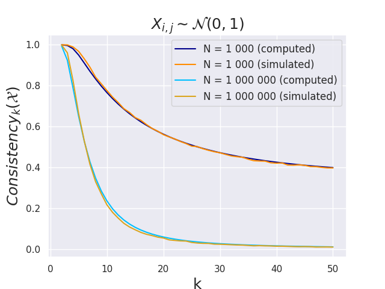
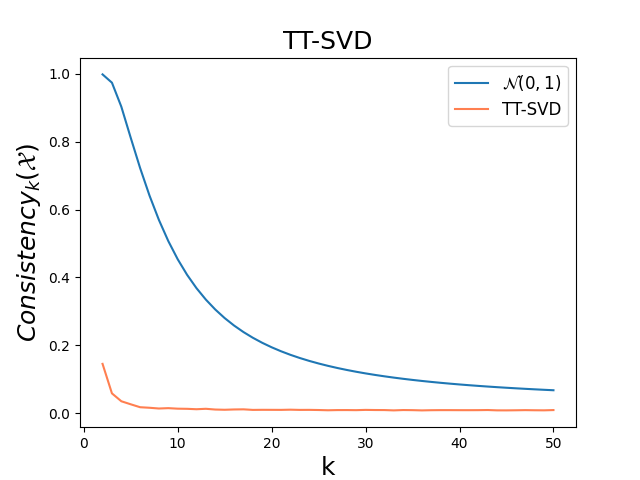

# RecSys 2023 -- Average Consistency
Repository for the RecSys 2023 Paper "On the Consistency of Average Embeddings for Item Recommendation" by W. Bendada, G. Salha-Galvan, R. Hennequin, T. Bouabça and T. Cazenave


# Installation
The following lines of codes clone the project, download the public datasets used for our experiments and install some standard machine learning library (including torch) required to reproduce our results.
```
git clone https://github.com/deezer/consistency.git
cd consistency
curl https://zenodo.org/record/5121674/files/song_embeddings.parquet?download=1 --output data/song_embeddings.parquet
pip install -r requirements.txt
```
# Experiments
## Theoretical consistency
The script `plot_distributions_consistency.py` will reproduce the plots of **Figure 2**. It brings a comparison between average consistency as computed using **Proposition 2** versus the one observed for a set of embeddings sampled from the same given distribution. For instance, running
```
python -m plot_distributions_consistency -d normal
```
will plot the following distribution




## Empirical consistency
The script `plot_real_embeddings_consistency.py` will reproduce the plots of **Figure 3**. It brings a comparison between average consistency of a real-world set of embeddings versus the one computed for a set of i.i.d vectors of the same size and dimensions following a normal standard distribution. For instance, running
```
python -m plot_real_embeddings_consistency -s svd
```
will plot the following distribution



## Optionnal : Normal Approximation

The script `plot_normal_approximation.py` will reproduce the plots of **Figure 1**. It illustrates how inner products between i.i.d vectors can be approximated by a normal law provided that the dimension of those vectors is large enough, regardless of the family of distributions that those vectors follow. For instance, running
```
python -m plot_normal_approximation -d normal
```
will plot the following distribution

_uniform.png)
